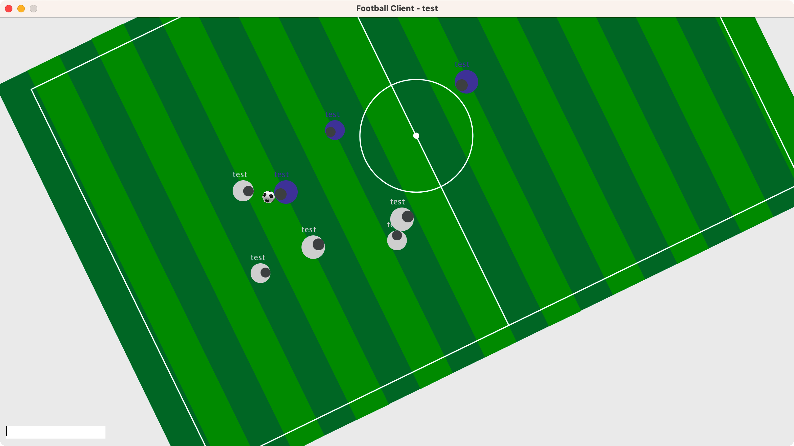
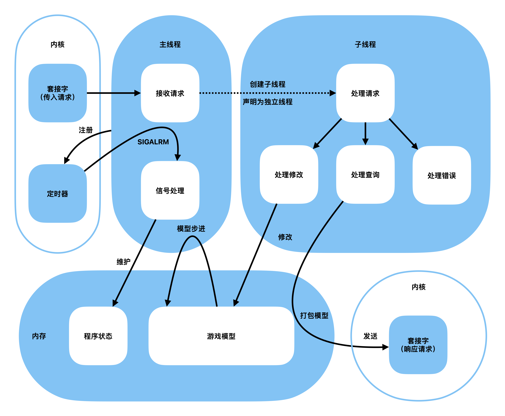
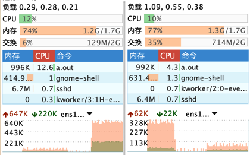

## 说明
　　本文是选修 Linux 操作系统后，完成结课大作业时编写的报告。

　　在完成结课大作业的过程中，我编写了一个游戏服务端程序、一个对应的游戏客户端程序。

　　在编写服务端程序的过程中，我使用 Linux 系统调用实现了全部游戏逻辑、交互协议、多用户并发访问和基本的状态/故障指示。

　　该服务端程序运行于 Linux 操作系统上，部署在位于新加坡的 CentOS 服务器上，可在互联网上直接访问。该服务器配备了 10Gbps 网卡，但由于服务器的地理位置在海外，网络连接会受到主干网出口的影响。

```shell
vi server.c
cc -lm -lpthread server.c # 在x86机器上编译需要“-std=gnu99”
```

　　该服务端程序使用 C 语言编写，源代码采用 C99 标准，使用了 `math` 库和 `pthread` 库，在编译时需要额外指明连接这两个库；使用 aarch64 架构 Linux 系统接口，具体系统内核版本为 `5.14.0-214.el9`。



<!--truncate-->
　　该客户端程序使用 Java 编写，源代码采用 Java 1.8 SE，使用 Java Swing 图形化接口。上图展示了10个玩家同时游戏时，其中一位白方玩家的客户端状态。

## 成果介绍

　　我编写的是一款多人足球游戏，给它的名字是 football 1922，代表该游戏一百年以前，象征这是一款画质和玩法上古的游戏。游戏默认支持最多 10 人同时在线游玩，可以通过调整源代码中的宏定义来修改最多游戏人数。游戏服务端按照玩家的进入顺序，将他们分为两队相互对抗。

　　由于 COVID-19 肆虐全国，本人也不幸中招，我在完成大作业时，不得不遵循非必要不设计的原则，以在本就不富裕的清醒时间中完成任务。双端从设计到编写完成一共花费了 16hr，仅持续工作了不到两天，论其速度，也算得上是我个人历史上的工程奇迹了。

### 玩法介绍

　　玩家可以在球场上移动、转向、碰撞、抢球、传球和冲刺。

　　首先需要用鼠标点击聚焦客户端左下角的文本输入框，使 Java Swing 能够读取玩家的键盘信息。

#### 移动
　　使用 `W`、`A`、`S`、`D` 来前后左右移动画面中的角色。你会看到角色在画面中的绝对位置并未改变，而是角色脚下的地图在移动。这是由于客户端在现实画面的时候进行了坐标系变换，玩家看到的是自己角色视角下的画面。

　　玩家的默认移动速度可以在服务端代码的宏定义中调节。

#### 转向
　　使用 `J` 向左转，使用 `L` 向右转。同角色移动一样，旋转会改变画面的视角，因为玩家相对于地图在旋转。

　　玩家的转向速度可以在服务端代码的宏定义中调节。

#### 碰撞
　　当两个玩家相互运动直到接触时，玩家之间的距离将不能再减小。当一位玩家静止不动时，其他玩家可借助这种碰撞来推动静止的玩家。

　　同样的，由于存在碰撞，当玩家运动到地图边缘时，将不能继续运动离开地图。

#### 抢球
　　当玩家和球相遇之后，球将会自动被转移到玩家正前方紧贴玩家处，此过程被称为抢球/持球。

　　不同队伍的玩家可以通过运动到对方玩家正前方，来获得球的控制权。

#### 传球
　　当玩家持球时按下 `K` 键，球将会被以大于玩家的速度被向前弹出。

　　同一队伍的玩家可以借此将球向前快速传递，你也可以用这个动作来射门或躲避对方的抢球。

　　传球时，球会被赋予向前一定范围内随机方向的速度，用来模拟玩家传球时的误差，该散射角度可以在服务端的宏定义中调节。

#### 冲刺
　　当玩家希望以更快的速度移动时，可以按下 `I` 键。这将消耗球员的体力来获得部分加速。

　　球员的体力由球员的半径所体现，当球员的体力（半径）减少到一定程度后，玩家将不能再加速。体力（半径）会在玩家没有加速的时候缓慢恢复。

　　以上所有参数：加速比率、体力消耗速率、体力恢复速率、最大半径和最小半径，都可以在服务端的宏定义中调节。

### 架构视图

　　本节将介绍服务端软件的设计结构，其基本框架如图下图所示。



### 代理线程
　　当收到来自客户端的请求时，主线程（父线程）会创建一个子线程来与之对接，翻译客户端端的请求，并代理客户端修改游戏模型中由客户端控制的部分，从而保证玩家的意图能被正确传递到服务端。子线程会在创建后，立即断开与父线程的连接，防止僵尸线程。

### 模型步进
　　服务端在启动时，先初始化程序状态和游戏模型，同时向操作系统内核注册一个真实时间的定时器，用来按时计算模型的演化。

　　游戏模型中的玩家部分被来自客户端的请求不断修改，当主线程收到来自内核的定时器信号时，立即快开始推算游戏的下一帧，判断并调整游戏内各个元素的状态；同时维护程序状态，定时在标准输出流中写入游戏状态信息。

　　服务端程序已经预先编写好了，能输出游戏模型大部分状态的函数，可以简单修改代码实现定时展示系统状态。默认系统每 10sec 输出一次 heartbeat，用来表示自己正常运行。

### 技术选型

#### 并发
　　本程序使用多线程技术来实现并发。

　　子线程在创建后立即与父线程断开连接。

#### 通信
　　本程序使用全局变量来进行通信。

　　由于程序在运行时只有一个进程，因此不需要使用进程间通信。由于需要通信交换数据的部分即为游戏模型，而游戏模型的生命周期即为服务端进程的生命周期，因而可以直接采用全局变量来实现线程间通信。

#### 同步
　　本程序不使用同步技术。

　　程序在设计时按照代理模式，一个客户端只更新内存中对应自己的数据，不存在写入竞争，故不需要使用同步技术。

　　对于脏读的问题，由于程序默认的模型刷新时间间隔为 10ms，部分写入的客户端状态数据只会影响很短的时间，在下一次模型刷新时被修正，这种误差对用户来说是很难感知的。

#### 更新
　　本程序使用真实时间的定时器来实现稳定更新。

　　游戏服务端在初始化时即向操作系统注册了一个定时器，采用较短时间间隔的真实时间定时。通过信号处理函数来实现定时更新模型。

### 协议
　　我设计了定长的字节协议，方便两端读取信道中的消息，也为未来优化通信时，建立持续信道做准备。

#### 请求定义
　　请求头部为 4 个字节的标识，标识请求的类型。合法的请求类型已在宏定义中列出。

　　请求体为一个联合体，包含了三种可能的消息内容：加入时的姓名、要退出游戏的 `id` 和玩家的指令。

　　玩家的指令由四个字节的 `id` 和四个字节的具体指令组成。

　　合法的指令已由宏定义给出，将需要的指令按位或连接即可得到传送时的指令。

```c
#define GET_STATUS  0
#define UPDATE_SELF 1
#define JOIN_GAME   2
#define QUIT_GAME   3

#define TURN_LEFT     0x01
#define TURN_RIGHT    0x02
#define MOVE_LEFT     0x04
#define MOVE_RIGHT    0x08
#define MOVE_FORWARD  0x10
#define MOVE_BACKWARD 0x20
#define SHOOT         0x40
#define SPEED_UP      0x80

typedef struct player_instruction {
    int  id;        // 要更新的玩家id
    int  move;      // 要更新的玩家数据，由上方的宏定义连接得到
} ORDER;

typedef union req_data {
    char   join_name[64];
    int    quit_id;
    ORDER  order;
} req_data;

typedef struct request {
    int      flag;
    req_data data;
} req;
```

#### 响应定义
　　按照不同的请求类型，服务端直接响应对应的结构体，仅当遇到无法解析的请求时，会发送“bad request”字符串。

## 困难与解决
　　在设计与实现服务端和客户端程序的过程中，我也遇到了些许问题。

### 协议设计
　　在程序设计早期，我有考虑过采用类似 HTTP 的字符请求响应协议，但由于这样做涉及到大量字符串操作，可能会影响性能，以及为编程和 debug 带来困难，我最后采用了统一请求格式的字节协议。

　　通过请求消息结尾的联合体，可以解析为不同请求的具体消息，这样也方便了消息的统一读取。

### 并发处理
　　在程序设计早期，我有考虑过使用 epoll 的 I/O 多路复用来实现并发，但马上由于其设计和实现的困难程度而放弃了 I/O 多路复用，转而使用传统的多线程/多进程方案。

　　使用 epoll 最难的部分是非阻塞信息处理。由于需要设置非阻塞的信道，这将导致一条消息可能会被拆分成多部分分开被读取。处理这种情况需要将不完整的消息先缓存，等待所有消息被读取，能组合成完整的协议消息时，再来解析该信息。这样会导致程序的设计难度大大提高。

### 数据同步
　　使用多进程需要做到不同进程间的数据源统一，需要使用消息队列，管道或共享内存；还需要使用信号量或者锁来进行同步，这为程序的编写和 debug 带来了不小难度。

　　我最后采用了多线程，并使用全局变量来通信，当有同步需要时，可以简单的通过锁协议来实现。

## 特性
　　本章将介绍我在完成大作业过程中所设计的双端程序的特性。

### 模型更新
　　使用定时器信号实现真实时间下的模型更新，模型演化的时间误差不到 0.5%。

### 应用层协议

- 采用类 HTTP 的无状态协议，不需要建立持续连接，实现了单一职责。

- 采用统一请求结构，使得消息的读取写入变得方便。

- 模仿 `fcntl` 中的 `flag`，采用按位或连接多个操作，压缩并简化了表示消息的结构。

### 性能和负载
　　内存占用维持在 1M 以内，CPU 占用在 5% 以内。基本不受负载影响。

　　由于使用了高效的字节协议，在每秒 50 次请求时，网络负载为上行 66kB/s，下行 33kB/s。网络负载与请求量基本维持线性关系。



　　上图展示了软件在每秒 50 次请求下的负载，在一次消息结构优化后，响应消息的长度减短了 85%，该图也展示了在每秒 50 次请求时，消息结构优化前后的网络负载变化。

### 压力测试
　　我尝试使用定时器发送每秒一千次（实际 600+ 次每秒）获取游戏状态的压力测试，在该负载下，CPU 占用为 12.6%。

　　由于请求消息长度较短，每次请求上行只会传递 1076 字节，所以瓶颈基本出现在请求的响应频率上（创建 TCP 连接的频率）。

　　经过几轮测试，我得到的最大网络占用为 2.2M 字节每秒，约合请求响应 2000 次每秒。

　　游戏设计为 10 人同时在线，目标刷新率为 50Hz；每秒 2000 次请求能让每位玩家流畅游玩。