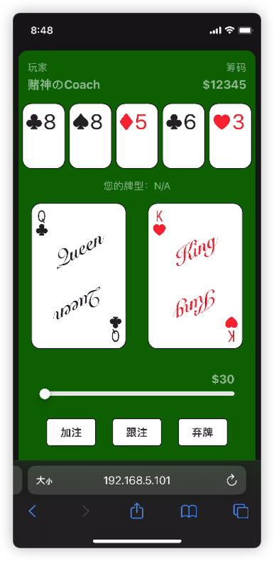
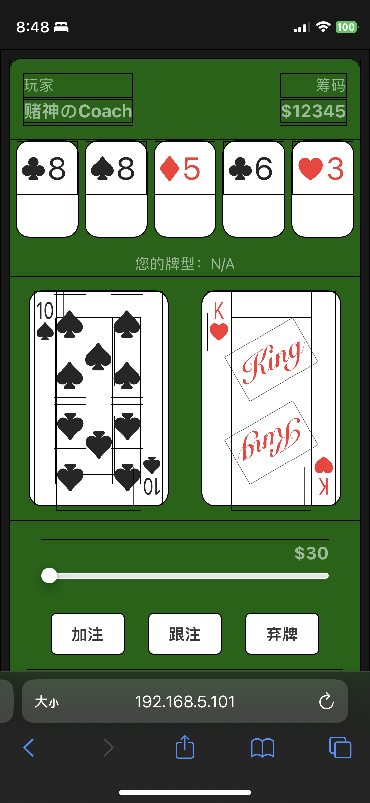

## 说明
　　在这篇博文中，我记录了我开发德州扑克 Web 小游戏的部分过程，包括想法来源、架构和技术栈、一些要点和问题、未来改进、游戏体验以及整活总结。

　　项目启动时间：2023 年 3 月 22 日；后端技术栈：Node.js，Express，JavaScript（后期将转写为TypeScript）；前端技术栈：Vue.js 3，Axios。

　　先贴张图镇楼 ;-)

<!--  -->

<!--truncate-->
## 想法来源

### 德州扑克

　　我的朋友们喜欢在周五周六晚上，在寝室里玩德州扑克来消遣。

　　有一次一位朋友带着扑克牌和筹码，出去和他的其他好友玩；那天晚上，其他人因为没有扑克牌和筹码而无法开局。

　　因此产生了这个想法：写一个能玩德州扑克的软件，让大家能在没有其他辅助设施的情况下，也能愉快的玩德州扑克；

　　之后也可能通过代码的拓展，让大家玩上其他牌类游戏。

### 洗牌

　　我们玩牌类游戏的一大问题，就是洗牌洗的不够分散。通过计算机模拟洗牌，能做到既快又让牌的分布更加随机。

### 结算

　　对于德州扑克，还有一个特殊的问题：当有玩家牌面大小相同或者 all in 时，计算并分割筹码会显得比较麻烦。

　　使用计算机程序解决这个问题，虽然需要下点功夫将问题抽象并用计算机语言解决，但毕竟是个一劳永逸的操作，也算值得一做。

## 架构和技术栈

### B/S 架构

　　考虑到游戏即兴开局的性质，我选择了 Web 开发。这样玩家就能在不用安装其他软件的情况下，直接使用手机上的浏览器进行游戏。

　　顺便，为了再次体验下大前端的魅力，我将使用 JavaScript 贯穿整个开发流程。因此，前端采用 Vue.js，后端采用 Node.js；后续可能会使用 TypeScript 对代码进行重构。

### Vue.js

　　Vue 的开发非常灵活，这里我选择使用单页应用开发方式。这个应用仅需一个页面，即用户的看牌和操作界面。再结合之前的 iOS 开发经历，我选择用单文件组件编写 UI，因为这令我感到非常熟悉。

　　下面聊聊使用到的 Vue 技术细节：

#### 模板
　　我用模板来做文本插值，显示一些简单的信息，例如：玩家名、筹码数和下注情况。在用户尚未翻牌时，通过在模板中插入三元表达式来保护牌面信息。每张扑克牌的花色和大小同样由插值传递。

#### 计算属性
　　计算属性被拿来表示用户可以下注的最高筹码，即当前下注筹码和持有筹码的和。

#### 条件渲染
　　随着游戏的进行，玩家可以进行的操作如下注、弃牌等，也在不停变化。同时，每种扑克牌的牌面展示花色的位置也不相同。因此我用不同的单页文件制作了 `A` - `10` 和带文字描述的 `JQK`。

　　这里用条件渲染来区分不同牌和展示不同状态下的按钮。

#### 列表渲染
　　列表渲染用于展示桌面上的牌和玩家手牌。

#### 事件处理
　　玩家调整下注筹码的操作会调用本地事件处理；玩家选择下注或弃牌等操作会触发事件让后端服务器处理。

#### 生命周期
　　向后端请求数据来更新前端界面时，需要等待 Vue 挂载结束，即 `onMounted()` 回调函数。

#### 组件
　　为了简化代码，每个单页文件应当承担较少的任务。

　　我将扑克牌及其牌面的花色布局规则抽出为多个单页文件，之后可能会按照同样的方式封装下注筹码调节的控件。

### Node.js

　　Node 也可以使用 JavaScript 开发，虽然模块化的方式略有不同： Node 使用 `exports` 的属性来导出，使用 `require()` 返回值的自动解包来导入。

　　我们的游戏都是临时玩一局，不会持续很长时间。每次开局大家都分得一样的筹码，因此也不需要做数据持久化。

　　这里后端选择 Node，也是作为 JavaScript 的函数式编程和ES6特性的练习。

#### WebSocket
　　为了主动通知前端向后端获取新的牌面信息，这里使用 WebSocket 来与前端保持连接，实现服务端推送。

#### Express
　　Express 提供了简化的 HTTP 请求处理封装：用方法名指定请求方法；用参数指定请求路径和处理函数，并在处理函数的参数中已经封装好了所有请求参数。

#### cookie-parser
　　Express 的一个中间件，方便在 Express 中获取和设置 cookie。

　　在这个游戏中，我将 cookie 设置为 3 小时过期。这已经超过了游戏持续的时间，所以不会影响游戏过程。

## 要点和问题

### 德州扑克规则

　　作为一个人类玩家，理解德州扑克规则是十分自然的。但是正如上面提到的：在处理有玩家 all in 且胜利的情况时，分割彩池里的筹码是个需要一点点思考的任务。

　　这种任务交给计算机虽可立刻给出答案，但这背后对应的是将游戏规则写入程序时掉的头发。

### 扑克牌牌面渲染

　　为了练习 flex 布局，我并没有用图片或者SVG来绘制扑克牌的牌面，而是手动用字符去做布局。但是为了方便，扑克牌的背面我还是使用了网络上查询到的一张扑克牌背面设计。

　　扑克牌 `A` - `10` 的布局参考了我手边的一副牌：花色有正有倒，整体呈多列排列。我使用了几个 Vue 单组件文件来绘制牌面，然后加上左上和右下的牌面标志，封装成了扑克牌展示的小组件。

### JavaScript 弱类型

　　在编写前端的控制按钮时，由于用户浏览器情况不同，加法可能会和字符串连接冲突，有时需要强制类型转换。这体现在 Vue 的代码编译后，在不同的平台尝试用「-1」按钮减少下注筹码时，可能会直接将字符串"-1"拼接在原数据末尾。

　　这里我使用了强制类型转换，来避免这种发生这种情况。

### 字体

　　并不是所有字体都包含程序所用到的字符「桃心梅方」。

　　为了让各位玩家手机上的界面显示尽可能一致，我在字体库中选择了一套看起来还不错的字体，并在 CSS 中手动指明了字体。

## 未来改进

### CSS与浏览器版本

　　为了让玩家手机上的手牌信息不那么明显，我默认让玩家的手牌朝下，当玩家按下按钮时，牌会翻转过来。在设计翻牌的动画时我发现：一些老版本的浏览器不支持带正反面显示的立体翻牌效果。在多次尝试更改 CSS 无果后，我就先放弃了这种支持。

　　后续可能会通过媒体查询来为低版本的浏览器，设计更简单的翻牌效果，例如直接透明度渐变。

### 版本控制

　　由于软件的结构十分简单，所以我最开始并没有做版本控制。

　　后续在更新的时候，需要中途接入 git 来管理版本；之后也可能会开源代码共同学们评判。

### 前后端交互的封装

　　为了尽可能暴露少的接口，我每遇到一个前端需要的数据，就开放一个接口来响应请求。这导致在程序编写的后期，有很多请求可以合并，例如：桌面上的牌、游戏状态、正在思考的玩家编号、各玩家的下注情况和玩家的牌型等。

　　后期再优化处理效率的时候，可以合并这些请求。

## 游戏体验

　　我们在周末试玩了我写的德州扑克。游戏体验并没有像我们用实体扑克牌和筹码那样欢乐。实体扑克牌翻牌总是令人激动；下注时，清点自己的筹码也让人更加深思熟虑；最后结算时，将场上的筹码收入囊中整理也更有成就感。

　　手机上的电子游戏缺少了这种实体交互，总让人的操作更加无感。这也是人们在网上购物时，容易花更多的钱的原因吧。

## 整活总结

　　本次整活尝试了 Vue 和 Node；回顾了 CSS 中的元素布局和转场效果；尝试了 ES6 中的部分新特性；使用了 Node 和 Vue 生态下的几个库。这次简单的大前端编程尝试，我查阅了不少文档，也感受到了前端社区的活跃。

　　希望同学们也能不时在自己喜欢的领域做这样的尝试：从生活中发现问题，分析需求并用自己所学的知识来解决问题。同时分析自己构建整个过程中遇到的问题和改进方式，给出自己的思考。
