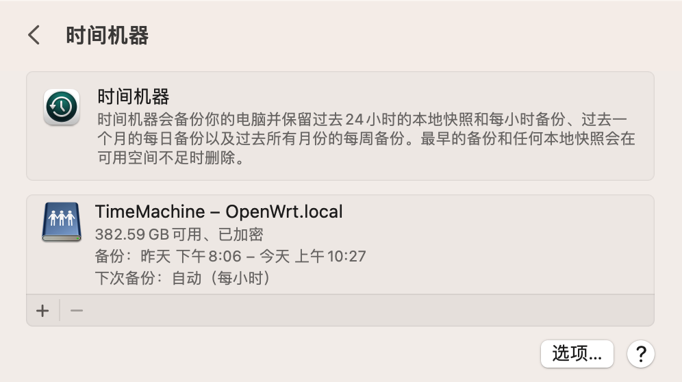

2023 年 3 月 22 日更新：刚刚 Time Machine 帮我挽回了一份没保存的 Keynote 文件，虽然文件不太重要，但也减少了我重新编写文件的时间。

----

　　本篇博文将介绍我借助 mbentley 提供的镜像使用 Docker 在 OpenWrt 系统的软路由下部署网络存储，并应用于 Time Machine。本文同时介绍了一种机械硬盘的数据记录技术和磁盘文件系统。

<!--truncate-->

## 前情提要

　　这里是一些概念的介绍，对此较为了解的同学可以直接看实践的部分。

### Time Machine

　　Time Machine（时间机器）是苹果公司就著 macOS 操作系统而推出用作备份的工具程序。此程序可与苹果公司出品的网络存储设备 AirPort 时光囊、内置无线 Wi-Fi 网络的硬盘、内置及外置的设备配搭使用。

　　Time Machine 会每天自动把用户系统上文件创建备份（也包括操作系统本身），能让用户回溯任何被变更或删除的文件到指定的日期以供日后恢复。

　　根据我过去使用 Time Machine 的经验来看，这个工具能无声无息的完成同步和备份，也能在关键时刻找回很多重要文件。这种本可以做到类似 iCloud 的润物无声的体验，却总是被有线连接的硬盘给打断。因此，我希望能想办法在局域网挂载一个网络存储设备，来实现 Time Machine 的功能。

### OpenWrt

　　OpenWrt 是适用于嵌入式设备的一个 Linux 发行版，一般运行在软路由上。

　　OpenWrt 本身未带任何 UI，需要通过 LuCI、webif 等各种延伸界面，LuCI 界面是使用率最高的 Web 管理界面。

　　我使用一台 ABOX-600 来充当软路由，并在其上安装了 OpenWrt 作为系统。选用 OpenWrt 的理由之一是，它的众多软件包中包含 Docker。这将方便我以后部署其他我需要的服务。

### Docker

　　Docker是一个开放源代码的开放平台软件，用于开发应用、交付（shipping）应用和运行应用。Docker 允许用户将基础设施（Infrastructure）中的应用单独分割出来，形成更小的颗粒（容器），从而提高交付软件的速度。

　　这里我使用 Docker 运行 mbentley 提供的镜像，用来提供 AFP 协议的网络存储。

### EXT4

　　第四代扩展文件系统（Fourth extended filesystem，缩写为 ext4）是 Linux 系统下的日志文件系统，是 ext3 文件系统的后继版本。

　　由于 OpenWrt 使用 Linux 内核，我选择将磁盘格式化为该文件系统，以便防止与软路由的 Linux 文件系统不同而发生冲突。

### SMR

　　叠瓦磁记录（Shingled magnetic recording，SMR，直译为分层磁记录），是一种用于硬盘驱动器的磁存储数据记录技术，可提高存储密度和每个驱动器的整体存储容量。常规的硬盘驱动器通过写入彼此平行而不重叠的磁道来记录数据（垂直磁记录，PMR）。而叠瓦磁记录技术的硬盘写入的新磁道则与先前写入的磁道部分重叠，从而使先前的磁道更窄，因此能拥有更高的磁道密度。

　　由于磁道存在重叠，叠瓦磁盘的写入过程较为复杂。同学们只需要知道，当SMR磁盘在尝试随机读写时，会有很明显的性能瓶颈。

## 小插曲

　　我在网上物色了一块闪迪云盘 ECO 1.92T 的 SSD，这是一块上电了 4 年的企业级固态，采用马牌主控，2G 缓存，拥有掉电保护。由于担心其主控因为上电时间过长而不时掉盘，我将我台式机中的一块英特尔企业级 SSD 拆下来换上闪迪云盘，只用来存游戏；英特尔 SSD 则放到软路由中作为备份盘。

　　在实操之前，我找好友借到了一块东芝 2.5 寸 2T 移动硬盘挂载到软路由上作为试验。在尝试将其格式化为 EXT4 文件系统的过程中，我的Web管理界面出现了明显的卡顿。我随后将该移动硬盘挂载到 MacBook 上，用我笔记本上的 CentOS Stream 9 虚拟机对其进行格式化。我使用的指令是 `mkfs.ext4 /dev/sda -f`。随后我也察觉到了明显的 `iowait`，经 `strace` 查看得知，系统调用 `fallocate()` 迟迟没有返回。

　　我将笔记本设置为用不待机，用一晚上的时间完成了该磁盘的格式化。然后挂载到软路由上开始使用。该磁盘默认采用 `0022` 的 `umask` 挂载，这导致我在尝试给 Docker 中的用户分配 `rwx` 权限时，命令无法生效。我随后发现并改正了默认 `umask`，但这样挂载的磁盘却总是让系统处于 `iowait` 状态，无法快速响应我的操作。

　　经询问得知，好友的这块 2.5 寸 HDD 为 SMR 磁盘。这让我想起我在物色备份盘时，并未在市场上发现超过 1T 的 2.5 寸机械硬盘。原来是东芝采用的 SMR 技术提高了磁盘容量的密度。我不得不庆幸当时没有选择 2.5 寸大容量机械来做备份盘，避开了我忘了注意的 SMR 问题。

## 实践操作

　　在开始操作之前，我已经将软路由刷入了 OpenWrt 系统，并安装了 Docker。

　　将英特尔SSD格式化为EXT4格式并挂载到软路由的 `/backup` 下。

　　在 Docker Hub 中检索 timemachine，找到了由 mbentley 在最近几日仍在维护的镜像："docker image to run Samba or AFP (netatalk) to provide a compatible Time Machine for MacOS"

　　我按照作者给的使用例，将 `/backup` 挂载到 `/opt/timemachine` 下，并给予 host 网络环境，启动后成功地让Mac在局域网下自动发现了该网络磁盘。

　　进入该容器下的终端，将 `/opt/timemachine` 的权限修改为 `0777`，以方便镜像内部非 root 账户操作该目录下的文件。

　　最后在 macOS 上的 Time Machine 上设置网络磁盘备份，输入设置的用户名和密码后选择加密备份，Time Machine 成功连接到 Docker 虚拟的 AFP 磁盘。

　　在经过长达5小时的初次备份后，Time Machine 能正常做到保留 24 小时内的每小时备份，一个月内的每天备份和每月备份。

## 参考资料

Time Machine：https://zh.wikipedia.org/wiki/時光機_(macOS)

OpenWrt：https://zh.wikipedia.org/wiki/OpenWrt

Docker：https://zh.wikipedia.org/wiki/Docker

EXT4：https://zh.wikipedia.org/wiki/Ext4

SMR：https://zh.wikipedia.org/wiki/叠瓦磁记录

timemachine Docker镜像：https://hub.docker.com/r/mbentley/timemachine