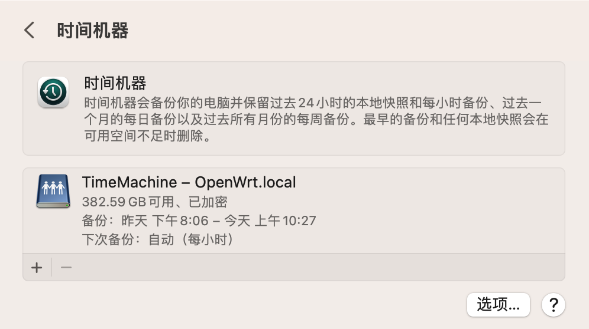

Update, March 22, 2023: Time Machine just rescued an unsaved Keynote file for me. The file wasn't that important, but it did save me the time of writing it all over again.

----

In this post I'll walk through how I used Docker on an OpenWrt router, with an image provided by mbentley, to deploy network storage and use it for Time Machine. Along the way, this post also introduces a data-recording technology used in mechanical hard drives, and a disk filesystem.

<!--truncate-->

## Background

This section introduces a few concepts. If you already know them well, feel free to skip straight to the hands-on part.

### Time Machine

Time Machine is the backup utility Apple ships with macOS. It works with Apple's network storage device (the AirPort Time Capsule), hard drives with built-in Wi-Fi, and internal or external drives.

Time Machine automatically backs up the files on your system every day (including the operating system itself), letting you roll any changed or deleted file back to a chosen date for later recovery.

In my experience, Time Machine syncs and backs up silently in the background, and at critical moments it has recovered plenty of important files for me. That could-be-effortless, iCloud-like experience, however, kept being interrupted by having to plug in a hard drive. So I wanted to find a way to mount a network storage device on my LAN to make Time Machine truly wireless.

### OpenWrt

OpenWrt is a Linux distribution for embedded devices, typically running on x86 soft routers.

OpenWrt itself ships without any UI; you manage it through extensions like LuCI or webif — LuCI being the most widely used web management interface.

I use an ABOX-600 as my soft router, with OpenWrt installed as its system. One of the reasons I chose OpenWrt is that its package repository includes Docker, which makes it easy to deploy whatever other services I need later.

### Docker

Docker is an open-source platform for developing, shipping, and running applications. It lets you split applications out of your infrastructure into smaller units (containers), which speeds up software delivery.

Here I use Docker to run mbentley's image, which provides network storage over the AFP protocol.

### EXT4

The fourth extended filesystem (ext4) is a journaling filesystem for Linux, the successor to ext3.

Since OpenWrt runs on the Linux kernel, I chose to format the disk with this filesystem to avoid conflicts with the router's own Linux filesystem.

### SMR

Shingled magnetic recording (SMR) is a magnetic storage technology for hard drives that increases areal density and overall capacity per drive. Conventional hard drives record data by writing tracks parallel to each other without overlapping (perpendicular magnetic recording, PMR). An SMR drive instead writes each new track partially overlapping the previous one, making the previous track narrower and thus allowing higher track density.

Because the tracks overlap, writing to a shingled disk is more complicated. All you really need to know is this: when an SMR disk attempts random reads and writes, it hits a very noticeable performance bottleneck.

## A little detour

I had found a SanDisk CloudSpeed ECO 1.92T SSD online — an enterprise drive with 4 years of power-on time, a Marvell controller, 2 GB of cache, and power-loss protection. Worried that its controller might start dropping out after so many power-on hours, I pulled an Intel enterprise SSD out of my desktop and swapped in the SanDisk to hold nothing but games; the Intel SSD went into the soft router as the backup drive.

Before the real thing, I borrowed a Toshiba 2.5-inch 2 TB portable hard drive from a friend and mounted it on the soft router as a trial. While trying to format it as EXT4, my web management interface started visibly stuttering. I then attached the drive to my MacBook and formatted it from a CentOS Stream 9 virtual machine, using `mkfs.ext4 /dev/sda -f`. Soon I noticed significant `iowait`; `strace` showed that the `fallocate()` system call simply wasn't returning.

I set the laptop to never sleep and let the format run overnight, then mounted the drive on the soft router and started using it. The disk mounted with a default `umask` of `0022`, so my attempts to grant `rwx` permissions to the user inside Docker had no effect. I found and fixed the default `umask`, but the mounted disk still kept the system stuck in `iowait`, unable to respond to anything quickly.

I asked around and learned that my friend's 2.5-inch HDD was an SMR disk. That reminded me of something from when I was shopping for a backup drive: I couldn't find any 2.5-inch mechanical drive above 1 TB on the market. So that's how Toshiba got the density up — SMR. I count myself lucky that I didn't pick a large 2.5-inch mechanical drive for backups, dodging an SMR problem I had completely forgotten to check for.

## Hands-on

Before starting, I had already flashed the soft router with OpenWrt and installed Docker.

Format the Intel SSD as EXT4 and mount it at `/backup` on the router.

Searching Docker Hub for "timemachine" turned up an image by mbentley, still actively maintained as of a few days ago: "docker image to run Samba or AFP (netatalk) to provide a compatible Time Machine for MacOS".

Following the author's usage example, I mounted `/backup` at `/opt/timemachine` and gave the container the host network. Once started, my Mac automatically discovered the network disk on the LAN.

Inside the container's shell, change the permissions of `/opt/timemachine` to `0777` so that the non-root account inside the image can work with files in that directory.

Finally, set up network disk backup in Time Machine on macOS: enter the configured username and password, choose encrypted backup, and Time Machine connects to the AFP disk virtualized by Docker.

After an initial backup that took a good 5 hours, Time Machine now properly keeps hourly backups for the past 24 hours, daily backups for the past month, and monthly backups beyond that.

## References

Time Machine: https://en.wikipedia.org/wiki/Time_Machine_(macOS)

OpenWrt: https://en.wikipedia.org/wiki/OpenWrt

Docker: https://en.wikipedia.org/wiki/Docker_(software)

EXT4: https://en.wikipedia.org/wiki/Ext4

SMR: https://en.wikipedia.org/wiki/Shingled_magnetic_recording

The timemachine Docker image: https://hub.docker.com/r/mbentley/timemachine
