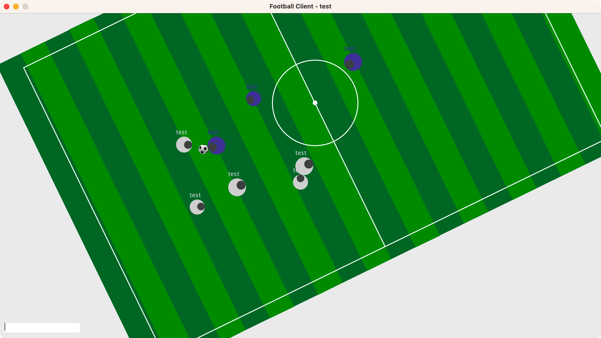
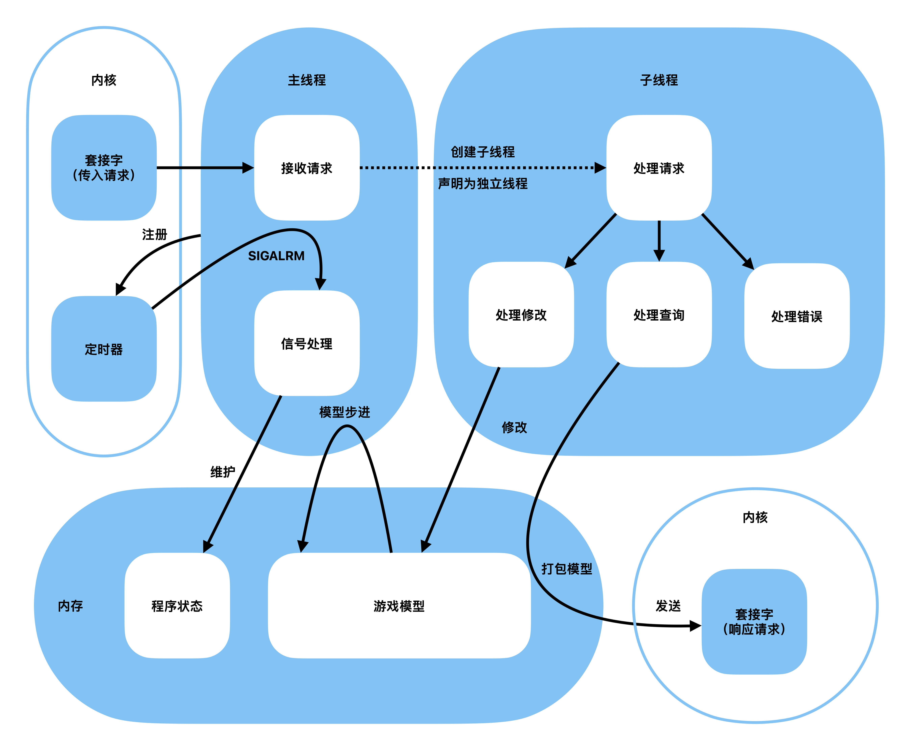
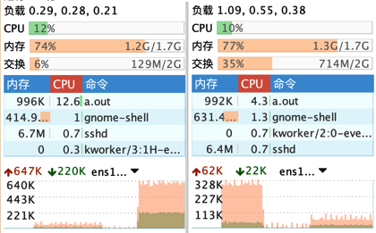

## About this report

This post is the report I wrote for the final project of my Linux operating systems elective.

For the project, I built a game server program and a matching game client.

The server implements all of the game logic, the wire protocol, concurrent multi-user access, and basic status/fault indication using Linux system calls.

It runs on Linux, deployed on a CentOS server in Singapore, directly reachable over the internet. The machine has a 10 Gbps NIC, but since it sits overseas, connections are affected by the backbone's international egress.

```shell
vi server.c
cc -lm -lpthread server.c # compiling on x86 requires "-std=gnu99"
```

The server is written in C against the C99 standard. It uses the `math` and `pthread` libraries, which must be linked explicitly at compile time. It targets the Linux system interfaces on aarch64; the exact kernel version is `5.14.0-214.el9`.



<!--truncate-->
The client is written in Java (Java SE 1.8) using the Java Swing GUI toolkit. The screenshot above shows the view of one white-team player during a 10-player game.

## The result

What I built is a multiplayer soccer game, and I named it football 1922 — dating the game a hundred years back, as a nod to its ancient graphics and gameplay. By default it supports up to 10 players online at once; the cap can be changed through a macro in the source. The server assigns players to two opposing teams in the order they join.

With COVID-19 raging across the country, I unluckily caught it myself. To finish the project within what little clear-headed time I had, I followed a strict "no unnecessary design" principle. From design to completion, both programs took 16 hours in total, over less than two days of work — speed-wise, something of an engineering miracle by my own standards.

### How to play

Players can move around the pitch, turn, collide, steal the ball, pass, and sprint.

First, click the text input box at the bottom-left of the client to focus it, so that Java Swing can read your keyboard input.

#### Moving
Use `W`, `A`, `S`, `D` to move your character forward, backward, left and right. You'll notice the character's absolute position on screen never changes — it's the map under its feet that moves. The client applies a coordinate transform when rendering, so what you see is the world from your own character's point of view.

The default movement speed can be tuned via a macro in the server code.

#### Turning
Use `J` to turn left and `L` to turn right. As with movement, turning changes the viewing angle, because the player rotates relative to the map.

The turning speed can be tuned via a macro in the server code.

#### Collision
When two players move into contact, the distance between them can shrink no further. If a player stands still, others can use this collision to push them around.

Likewise, thanks to collision, a player who reaches the edge of the map cannot keep moving off it.

#### Stealing the ball
When a player meets the ball, the ball automatically snaps to a spot directly in front of the player, hugging them — this is called stealing (or holding) the ball.

A player from the other team can take possession by moving directly in front of the ball holder.

#### Passing
Press `K` while holding the ball, and the ball shoots forward at a speed greater than the player's.

Teammates can use this to move the ball up the pitch quickly; the same action also works for shooting at the goal or dodging an opponent's steal.

When passed, the ball is launched in a randomly perturbed forward direction, simulating passing error; the scatter angle can be tuned via a macro on the server.

#### Sprinting
Press `I` when you want to move faster. This burns the player's stamina in exchange for a burst of speed.

A player's stamina is represented by their radius: once stamina (radius) drops far enough, sprinting stops working. Stamina (radius) slowly recovers while you are not sprinting.

All of these parameters — the speed multiplier, stamina drain rate, recovery rate, maximum and minimum radius — can be tuned via macros on the server.

### Architecture

This section describes the design of the server software; its basic structure is shown in the figure below.



### Agent threads
When a request arrives from a client, the main (parent) thread spawns a child thread to handle it. The child translates the client's request and, acting as the client's agent, modifies the part of the game model that this client controls — ensuring the player's intent is carried to the server correctly. Right after creation, the child detaches from its parent, preventing zombie threads.

### Stepping the model
On startup, the server initializes its program state and the game model, and registers a real-time timer with the kernel to advance the model on schedule.

The player portion of the game model is continuously modified by client requests. Whenever the main thread receives the timer signal from the kernel, it immediately computes the next frame of the game, evaluating and adjusting the state of every element; it also maintains program state and periodically writes game status to standard output.

The server comes with pre-written functions that can print most of the game model's state; a small code change is all it takes to display system status on a schedule. By default, it prints a heartbeat every 10 seconds to signal that it is running normally.

### Technical choices

#### Concurrency
The program uses multithreading for concurrency.

Child threads detach from the parent immediately after creation.

#### Communication
The program communicates through global variables.

There is only one process at runtime, so no inter-process communication is needed. The data that needs to be exchanged is exactly the game model, and the model's lifetime equals the server process's lifetime — so plain global variables suffice for inter-thread communication.

#### Synchronization
The program uses no synchronization primitives.

It is designed around the agent pattern: each client only ever updates its own portion of memory, so there are no write races and no need for synchronization.

As for dirty reads: with the default model refresh interval of 10 ms, a partially written piece of client state only matters for a very short window and is corrected at the next model refresh — an error users can hardly perceive.

#### Updates
The program uses a real-time timer for steady updates.

At initialization, the server registers a timer with the operating system at a short real-time interval, and the signal handler drives the periodic model updates.

### Protocol
I designed a fixed-length byte protocol, which makes messages in the channel easy for both ends to read, and prepares the ground for a future switch to persistent channels when optimizing communication.

#### Request format
A request starts with a 4-byte tag identifying the request type. The valid types are listed as macros.

The request body is a union of three possible payloads: the name used when joining, the id of the player quitting, and a player instruction.

A player instruction consists of a 4-byte id and a 4-byte command.

The valid commands are given as macros; OR together the ones you need to form the command to send.

```c
#define GET_STATUS  0
#define UPDATE_SELF 1
#define JOIN_GAME   2
#define QUIT_GAME   3

#define TURN_LEFT     0x01
#define TURN_RIGHT    0x02
#define MOVE_LEFT     0x04
#define MOVE_RIGHT    0x08
#define MOVE_FORWARD  0x10
#define MOVE_BACKWARD 0x20
#define SHOOT         0x40
#define SPEED_UP      0x80

typedef struct player_instruction {
    int  id;        // id of the player to update
    int  move;      // the update data, OR-combined from the macros above
} ORDER;

typedef union req_data {
    char   join_name[64];
    int    quit_id;
    ORDER  order;
} req_data;

typedef struct request {
    int      flag;
    req_data data;
} req;
```

#### Response format
For each request type, the server responds with the corresponding struct directly; only when a request cannot be parsed does it send the string "bad request".

## Problems and solutions
Designing and implementing the server and client came with its share of problems.

### Protocol design
Early in the design, I considered an HTTP-like textual request/response protocol, but that would involve heavy string manipulation — a potential drag on performance and a pain to program and debug — so I settled on a byte protocol with a uniform request format.

The union at the tail of the request message can be parsed into the concrete payload of each request type, which also makes messages uniform to read.

### Handling concurrency
Early on, I also considered epoll-based I/O multiplexing for concurrency, but quickly abandoned it for how difficult it is to design and implement, falling back to the traditional multithreading/multiprocessing approach.

The hardest part of epoll is non-blocking message handling. Because the channels must be set to non-blocking, a single message may arrive split into pieces across multiple reads. Handling that means buffering incomplete messages, waiting until everything has arrived and a complete protocol message can be assembled, and only then parsing it. That raises the design difficulty considerably.

### Data sharing
Multiprocessing would require a unified data source across processes, using message queues, pipes, or shared memory — plus semaphores or locks for synchronization — adding no small difficulty to both coding and debugging.

In the end I chose multithreading, with global variables for communication; should synchronization ever be needed, a simple lock protocol will do.

## Features
This chapter covers the properties of the two programs I designed for the project.

### Model updates
Timer signals drive model updates in real time; the timing error of the model's evolution is under 0.5%.

### Application-layer protocol

- An HTTP-like stateless protocol — no persistent connection required, and a single responsibility per request.

- A uniform request structure makes messages convenient to read and write.

- Multiple operations are OR-combined, mimicking the flags of `fcntl`, compressing and simplifying the message structure.

### Performance and load
Memory usage stays under 1 MB and CPU under 5%, largely unaffected by load.

Thanks to the efficient byte protocol, at 50 requests per second the network load is 66 kB/s upstream and 33 kB/s downstream, and it scales roughly linearly with request volume.



The chart above shows the software's load at 50 requests per second. After one optimization of the message structure, response length dropped by 85%; the chart also shows the network load before and after that optimization at the same request rate.

### Stress testing
I ran a stress test firing one thousand game-state requests per second from a timer (600+ per second in practice); under that load, CPU usage was 12.6%.

Requests are short — each carries only 1076 bytes upstream — so the bottleneck lies essentially in the request/response rate (the rate of TCP connection creation).

Over several rounds of testing, the peak network throughput I measured was 2.2 MB/s, roughly 2,000 request/responses per second.

The game is designed for 10 players online at a target refresh rate of 50 Hz; 2,000 requests per second is enough for every player to play smoothly.
