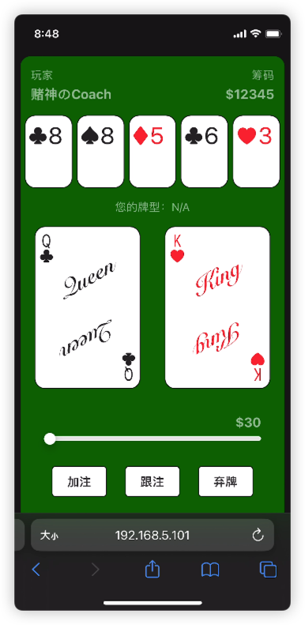
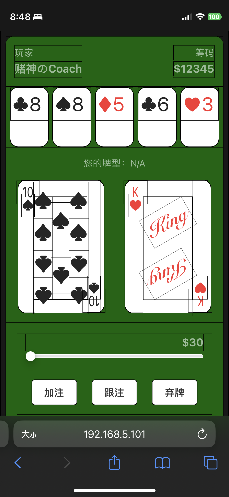

## About this post

In this post I document part of the process of building a Texas Hold’em web game: where the idea came from, the architecture and stack, some key points and problems, future improvements, how it actually played, and a wrap-up.

Project started: March 22, 2023. Back end: Node.js, Express, JavaScript (to be rewritten in TypeScript later). Front end: Vue.js 3, Axios.

A screenshot first ;-)

<!--  -->

<!--truncate-->
## Where the idea came from

### Texas Hold’em

My friends like to unwind on Friday and Saturday nights playing Texas Hold’em in the dorm.

One evening a friend took the cards and chips out to play with his other buddies — and that night, everyone left behind couldn't start a game for want of cards and chips.

Hence the idea: write a piece of software for playing Texas Hold’em, so everyone can enjoy a game with no physical equipment at all.

Later, the code might be extended to support other card games too.

### Shuffling

One big problem with card games is that human shuffling never mixes the deck thoroughly. Simulating the shuffle on a computer is both fast and more random.

### Settling the pot

Texas Hold’em has one more special headache: when players tie on hand strength or someone goes all in, computing and splitting the pot gets messy.

Solving this with a program takes some effort — abstracting the problem and encoding it — but it's a solve-once-and-forever job, well worth doing.

## Architecture and stack

### Client–server on the web

Given how spontaneously these games start, I went with web development: players can play right in their phone's browser without installing anything.

And, to enjoy the charm of the big-front-end world once more, I decided to use JavaScript across the whole stack: Vue.js on the front end, Node.js on the back end, with a possible TypeScript refactor later.

### Vue.js

Vue is very flexible to develop with; I chose the single-page-application approach. The app needs exactly one page — the player's view of the cards plus the controls. Drawing on my earlier iOS experience, I wrote the UI as single-file components, which felt very familiar.

Some Vue specifics I used:

#### Templates
Templates handle text interpolation for simple information: player names, chip counts, bets. Before a player reveals their cards, a ternary expression in the template keeps the card faces hidden. Each card's suit and rank are passed through interpolation as well.

#### Computed properties
A computed property expresses the maximum a player can bet — the current bet plus the chips they hold.

#### Conditional rendering
As the game progresses, the actions available to a player (bet, fold, and so on) keep changing; and every rank lays out its suit symbols differently, so I built `A`–`10` and the text-styled `J Q K` as separate single-file components.

Conditional rendering switches between the cards and between the buttons of each game state.

#### List rendering
List rendering displays the community cards on the table and the player's hole cards.

#### Event handling
Adjusting your bet triggers local event handlers; choosing to bet or fold fires events for the back-end server to process.

#### Lifecycle
Requesting data from the back end to refresh the UI has to wait for Vue to finish mounting — the `onMounted()` callback.

#### Components
To keep the code simple, each single-file component should carry as little responsibility as possible.

I extracted the playing card and its suit-layout rules into several components; the bet-adjustment control may get the same treatment later.

### Node.js

Node is also written in JavaScript, though its module system differs a bit: exports go on the `exports` object, and imports come from auto-unpacking the return value of `require()`.

Our games are one-off casual rounds that never last long, and everyone starts each round with the same chips, so there's no need for data persistence.

Choosing Node for the back end was also deliberate practice — JavaScript's functional style and the ES6 features.

#### WebSocket
To proactively tell the front end to fetch fresh card data, a WebSocket connection to each client enables server push.

#### Express
Express wraps HTTP handling neatly: the method name selects the HTTP verb; the arguments give the route and the handler, whose parameters arrive with everything already parsed.

#### cookie-parser
An Express middleware that makes reading and setting cookies easy.

I set cookies to expire after 3 hours — longer than any game lasts, so it never interferes mid-game.

## Key points and problems

### The rules of Texas Hold’em

For a human player, the rules of Texas Hold’em feel natural. But as mentioned above, when someone goes all in and wins, splitting the pot takes real thought.

Hand the job to a computer and the answer is instant — but behind that stands all the hair lost while encoding the game rules into a program.

### Rendering the card faces

To practice flex layout, I didn't draw the card faces with images or SVG — I laid them out by hand with characters. For convenience, though, the card back does use a design I found online.

The layouts for `A`–`10` follow a physical deck I had at hand: pips upright and inverted, arranged in columns. A few Vue single-file components draw the face, then the corner indices (top-left and bottom-right) complete the card as a small display component.

### JavaScript's weak typing

While writing the betting controls, addition could collide with string concatenation depending on the user's browser. After Vue compiles, tapping the "-1" button to reduce a bet could, on some platforms, simply append the string "-1" to the value.

I added explicit type coercion to keep that from happening.

### Fonts

Not every font contains the suit characters the app relies on — ♠ ♥ ♣ ♦.

To keep the interface as consistent as possible across everyone's phones, I picked a decent-looking font from a font library and pinned it explicitly in CSS.

## Future improvements

### CSS and browser versions

To keep hole cards from being too visible on a player's phone, cards start face-down and flip over while a button is held. Designing the flip animation, I found that some older browsers don't support the 3D two-sided flip. After several failed CSS attempts I set that support aside for now.

A media query may later serve older browsers a simpler flip — say, a plain opacity fade.

### Version control

The software's structure is so simple that I didn't set up version control at first.

Future updates will bring git into the picture mid-stream; the code may also be open-sourced for everyone to critique.

### Consolidating the API

Trying to expose as few endpoints as possible, I ended up opening a new endpoint for every piece of data the front end needed. By the late stage of development, plenty of requests were begging to be merged: the community cards, the game state, whose turn it is, each player's bets, hand rankings, and so on.

Those can be consolidated in a later efficiency pass.

## How it played

We play-tested my Texas Hold’em over the weekend. The experience wasn't as joyful as playing with physical cards and chips. Flipping real cards is always a thrill; counting your own chips before a bet makes you weigh it more carefully; and raking in the pot to stack your winnings is far more satisfying.

A game on a phone lacks that physical interaction, and every action feels a bit numb. Probably the same reason people spend more freely when shopping online.

## Wrap-up

This little adventure tried out Vue and Node; revisited CSS layout and transitions; sampled some ES6 features; and used several libraries from the Node and Vue ecosystems. Over this modest big-front-end exercise I read plenty of docs and felt how lively the front-end community is.

I hope you, too, will make attempts like this in a field you love from time to time: spot a problem in daily life, analyze the need, and solve it with what you know — then reflect on the problems you hit along the way, how you'd improve, and what you think about it all.
